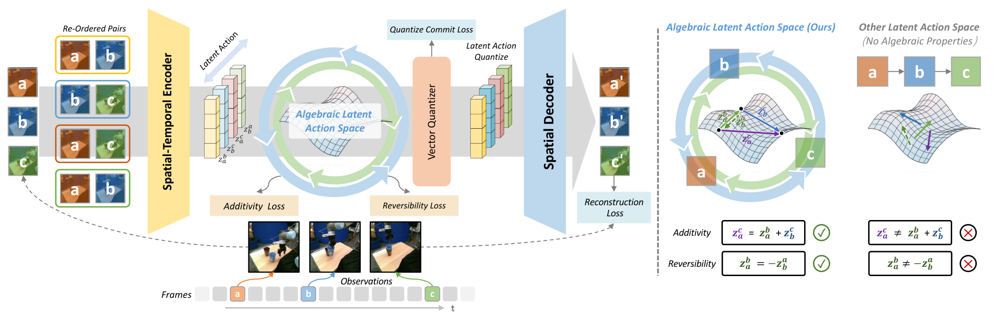
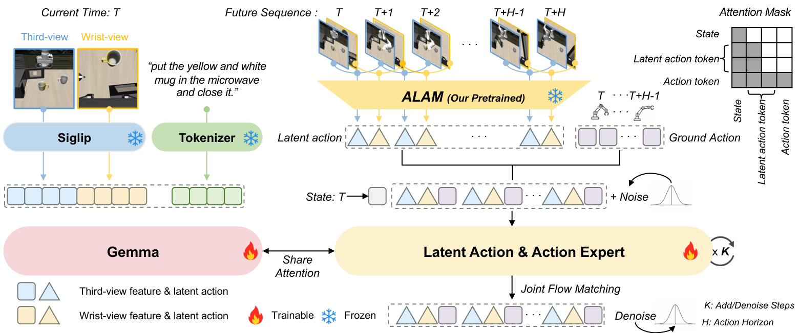

# ALAM: Algebraically Consistent Latent Action Model for Vision-Language-Action Models 

[](https://arxiv.org/abs/2605.10819)
[](LICENSE)
[](LICENSE)



*ALAM latent-action learning.*



*ALAM + π0 framework.*

ALAM learns structured latent actions from video and uses them to improve vision-language-action policies. This repository provides ALAM pretraining and ALAM + π0 training and evaluation for MetaWorld MT50 and LIBERO.

## 📰 News

- 🎉🎉🎉 **September 25, 2026**. **Ours ALAM has been accepted at NeurIPS 2026** 🥳🥳🥳

## 🛠️ Environment setup

We provide separate environments for ALAM pretraining and π0 post-training, plus a simulator environment for each evaluation benchmark.

From the repository root, copy `.env.example` to `.env` and install the stages you need:

```bash
cp -n .env.example .env

bash workflows/alam_pretraining/install.sh       # ALAM pretraining
bash workflows/pi0_post_training/install.sh     # π0 post-training
bash workflows/metaworld_evaluation/install.sh  # MetaWorld evaluation
bash workflows/libero_evaluation/install.sh     # LIBERO evaluation
```

Set dataset directories in `.env`; relative paths start at the repository root.

## 🎬 ALAM pretraining

We pretrain ALAM to learn latent actions from videos without action labels, using **Mix-11: 10 OXE datasets + CALVIN**.

| Pretrained weights | Dataset | Paper-scale resources | Download |
| --- | --- | --- | --- |
| ALAM latent-action tokenizer | **[OXE](https://github.com/google-deepmind/open_x_embodiment) (10 datasets):** RT-1 (`fractal20220817`), BridgeData-V2, TACO-Play, JaCo-Play, Berkeley Cable Routing, RoboTurk, NYU Door-Opening, VIOLA, Berkeley AutoLab UR5, TOTO.<br>**[CALVIN ABC→D](https://github.com/mees/calvin/blob/main/dataset/README.md)** | 128 × H20 GPUs | [🤗alam_pretrain](https://huggingface.co/Mark-ZJTang/alam_pretrain) |

Both checkpoints in `alam_pretrain` are pretrained on Mix-11; their directory names indicate the downstream policy that uses them. See the [pretraining guide](workflows/alam_pretraining/README.md) for dataset preparation and sampling weights.

```bash
bash workflows/alam_pretraining/pretrain.sh
```

## 🤖 ALAM + π0 post-training

We initialize the policy from π0 base and post-train it for 30k steps on action-labeled demonstrations, keeping the pretrained ALAM encoder frozen. A single LIBERO policy supports all four evaluation suites.

```bash
CUDA_VISIBLE_DEVICES=0,1,2,3,4,5,6,7 bash workflows/pi0_post_training/finetune_metaworld.sh my_metaworld_run
CUDA_VISIBLE_DEVICES=0,1,2,3,4,5,6,7 bash workflows/pi0_post_training/finetune_libero.sh my_libero_run
```

For a new robot environment or dataset, convert demonstrations to LeRobot format, adapt observation/action mappings, and compute dataset-specific normalization statistics. Follow [Fine-tuning on your own dataset](workflows/pi0_post_training/README.md#fine-tuning-on-your-own-dataset) for configuration and commands.

## 🎯 Evaluation

### 🤗 Post-trained weights

Download a policy and its matching ALAM tokenizer to evaluate. Training datasets are linked for fine-tuning; they are not needed for evaluation.

| Post-trained weights | Training dataset | Post-training resources | 🤗 Model download |
| --- | --- | --- | --- |
| ALAM + π0, MetaWorld | [🤗MetaWorld demonstrations](https://huggingface.co/datasets/Mark-ZJTang/metaworld_mt50) | 8 × H20 GPUs | [🤗alam_plus_pi_metaworld_mt50](https://huggingface.co/Mark-ZJTang/alam_plus_pi_metaworld_mt50) |
| ALAM + π0, LIBERO | [🤗LIBERO demonstrations](https://huggingface.co/datasets/Mark-ZJTang/libero_real) | 8 × H20 GPUs | [🤗alam_plus_pi_libero](https://huggingface.co/Mark-ZJTang/alam_plus_pi_libero) |

GPU counts in both weight tables describe our paper-scale training runs, not evaluation requirements. The following commands download both policies and their ALAM tokenizers to `evaluation/checkpoints/`:

```bash
bash workflows/install/install_environments.sh --components publish
bash workflows/publishing/download_release.sh --models-only
```

### ▶️ Run evaluation

```bash
# MetaWorld MT50: 50 tasks × 10 episodes
bash workflows/metaworld_evaluation/evaluate_mt50.sh --gpu 0

# LIBERO: all four suites, sequentially; 500 episodes per suite
bash workflows/libero_evaluation/evaluate_all_suites.sh --gpu 0
```

For a single LIBERO suite, run `bash workflows/libero_evaluation/evaluate_libero.sh spatial --gpu 0` (replace `spatial` with `object`, `goal`, or `long`). Use `--policy-checkpoint PATH` and `--alam-checkpoint PATH` for your own compatible policy and tokenizer.

See the [MetaWorld guide](workflows/metaworld_evaluation/README.md) and [LIBERO guide](workflows/libero_evaluation/README.md) for detailed options and paper results. Individual runs can vary.

## 🗂️ Repository layout

```text
ALAM/
├── Algebraic_latent_action_model/  # ALAM tokenizer and trainer
├── configs/lam/                   # Mix-11 pretraining configuration
├── workflows/
│   ├── alam_pretraining/          # Video pretraining
│   ├── pi0_post_training/         # Policy post-training and serving
│   ├── metaworld_evaluation/      # MetaWorld evaluation
│   └── libero_evaluation/         # LIBERO evaluation
├── evaluation/                   # π0 implementation and simulators
│   └── checkpoints/              # Downloaded weights
│       ├── alam/                 # Mix-11 pretrained ALAM tokenizers
│       ├── metaworld/            # Post-trained MetaWorld policy
│       └── libero/               # Post-trained LIBERO policy
├── data/                         # User-downloaded training data
│   ├── alam/{calvin,oxe_videos}/  # Pretraining data
│   └── lerobot/                  # Downstream demonstrations
└── outputs/                      # Training checkpoints and evaluation results
```

For model downloads and the maintainer's GitHub code-push command, see [Downloads and code publishing](workflows/publishing/README.md).

ALAM-authored code is available under [MIT or Apache-2.0](LICENSE), at your option. Bundled third-party material retains its own license.

## 📚 Citation

```bibtex
@article{tang2026alam,
  title={ALAM: Algebraically Consistent Latent Action Model for Vision-Language-Action Models},
  author={Tang, Zuojin and Liu, Haoyun and Chang, Xinyuan and Wu, Changjie and Huo, Dongjie and Yang, Yandan and Liu, Bin and Cai, Zhejia and Xiong, Feng and Xu, Mu and others},
  journal={arXiv preprint arXiv:2605.10819},
  year={2026}
}
```
